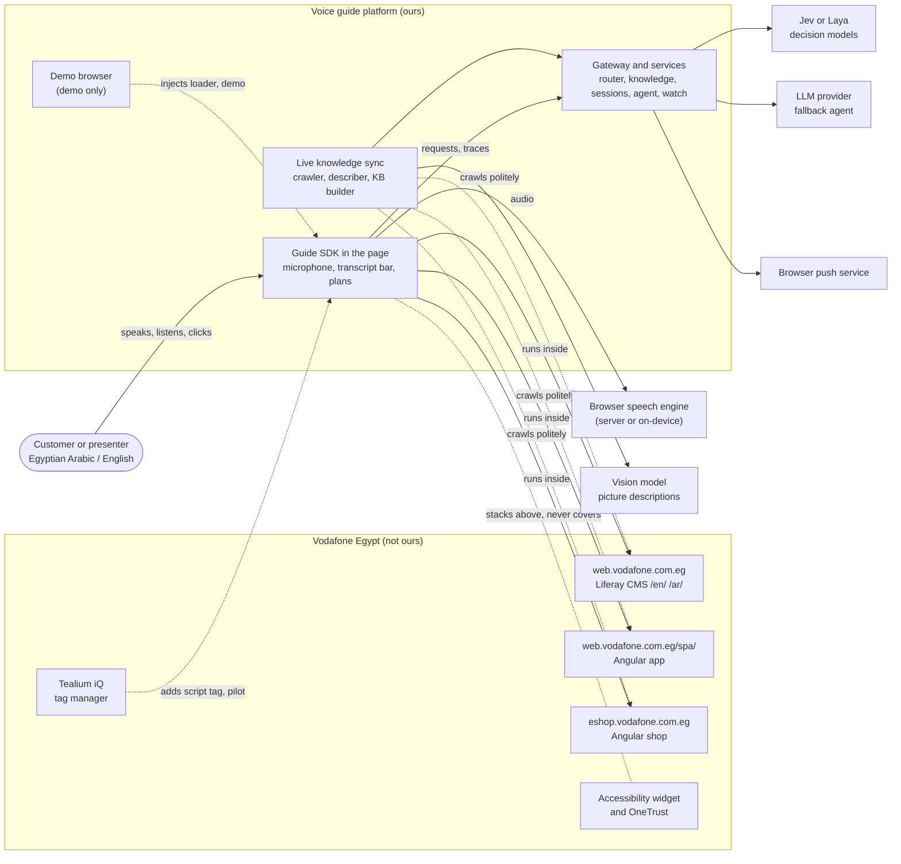

# 01 System context

Who and what the voice guide talks to. Solid lines exist in the demo build; dashed lines are added in the Vodafone live phase.

```mermaid
flowchart LR
  person(["Customer or presenter<br/>Egyptian Arabic / English"])
  subgraph vodafone["Vodafone Egypt (not ours)"]
    web["web.vodafone.com.eg<br/>Liferay CMS /en/ /ar/"]
    spa["web.vodafone.com.eg/spa/<br/>Angular app"]
    shop["eshop.vodafone.com.eg<br/>Angular shop"]
    tealium["Tealium iQ<br/>tag manager"]
    aw["Accessibility widget<br/>and OneTrust"]
  end
  subgraph ours["Voice guide platform (ours)"]
    sdk["Guide SDK in the page<br/>microphone, transcript bar, plans"]
    platform["Gateway and services<br/>router, knowledge, sessions, agent, watch"]
    sync["Live knowledge sync<br/>crawler, describer, KB builder"]
    demob["Demo browser<br/>(demo only)"]
  end
  speech["Browser speech engine<br/>(server or on-device)"]
  deciders["Jev or Laya<br/>decision models"]
  llm["LLM provider<br/>fallback agent"]
  vision["Vision model<br/>picture descriptions"]
  push["Browser push service"]

  person -- speaks, listens, clicks --> sdk
  sdk -- runs inside --> web
  sdk -- runs inside --> spa
  sdk -- runs inside --> shop
  sdk -- requests, traces --> platform
  sdk -- audio --> speech
  platform --> deciders
  platform --> llm
  platform --> push
  sync --> vision
  sync -. crawls politely .-> web
  sync -. crawls politely .-> spa
  sync -. crawls politely .-> shop
  sync --> platform
  tealium -. adds script tag, pilot .-> sdk
  demob -. injects loader, demo .-> sdk
  sdk -. stacks above, never covers .- aw
```
