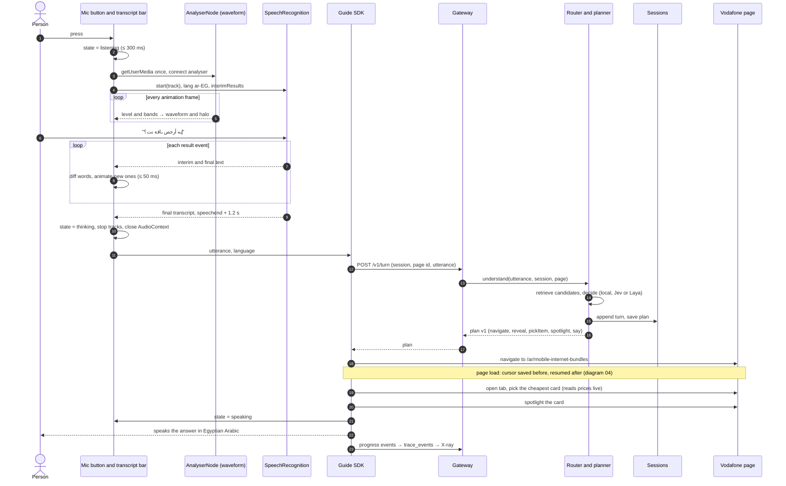

# 03 One voice request, end to end

From pressing the microphone to the spotlight on the answer (SPEC-02, ADR-0014, ADR-0015, ADR-0027).

```mermaid
sequenceDiagram
  autonumber
  actor P as Person
  participant M as Mic button and transcript bar
  participant A as AnalyserNode (waveform)
  participant R as SpeechRecognition
  participant G as Guide SDK
  participant W as Gateway
  participant RT as Router and planner
  participant S as Sessions
  participant Pg as Vodafone page

  P->>M: press
  M->>M: state = listening (≤ 300 ms)
  M->>A: getUserMedia once, connect analyser
  M->>R: start(track), lang ar-EG, interimResults
  loop every animation frame
    A-->>M: level and bands → waveform and halo
  end
  P->>R: "إيه أرخص باقة نت؟"
  loop each result event
    R-->>M: interim and final text
    M->>M: diff words, animate new ones (≤ 50 ms)
  end
  R-->>M: final transcript, speechend + 1.2 s
  M->>M: state = thinking, stop tracks, close AudioContext
  M->>G: utterance, language
  G->>W: POST /v1/turn (session, page id, utterance)
  W->>RT: understand(utterance, session, page)
  RT->>RT: retrieve candidates, decide (local, Jev or Laya)
  RT->>S: append turn, save plan
  RT-->>W: plan v1 (navigate, reveal, pickItem, spotlight, say)
  W-->>G: plan
  G->>Pg: navigate to /ar/mobile-internet-bundles
  Note over G,Pg: page load: cursor saved before, resumed after (diagram 04)
  G->>Pg: open tab, pick the cheapest card (reads prices live)
  G->>Pg: spotlight the card
  G->>M: state = speaking
  G-->>P: speaks the answer in Egyptian Arabic
  G->>W: progress events → trace_events → X-ray
```
