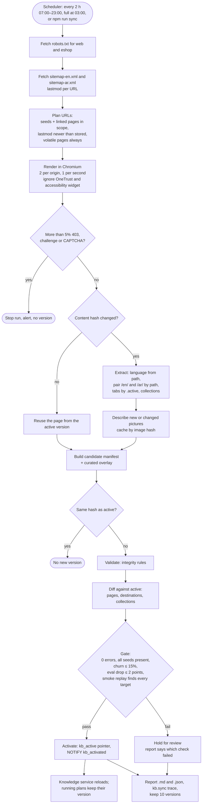

# 05 Live knowledge sync

One sync run (SPEC-04, ADR-0028).

```mermaid
flowchart TD
  start([Scheduler: every 2 h 07:00–23:00, full at 03:00,<br/>or npm run sync]) --> robots[Fetch robots.txt for web and eshop]
  robots --> sitemaps[Fetch sitemap-en.xml and sitemap-ar.xml<br/>lastmod per URL]
  sitemaps --> plan[Plan URLs:<br/>seeds + linked pages in scope,<br/>lastmod newer than stored,<br/>volatile pages always]
  plan --> crawl[Render in Chromium<br/>2 per origin, 1 per second<br/>ignore OneTrust and accessibility widget]
  crawl --> challenge{More than 5% 403,<br/>challenge or CAPTCHA?}
  challenge -- yes --> stop([Stop run, alert, no version])
  challenge -- no --> hash{Content hash changed?}
  hash -- no --> reuse[Reuse the page from the active version]
  hash -- yes --> extract[Extract: language from path,<br/>pair /en/ and /ar/ by path,<br/>tabs by .active, collections]
  extract --> describe[Describe new or changed pictures<br/>cache by image hash]
  reuse --> build
  describe --> build[Build candidate manifest<br/>+ curated overlay]
  build --> same{Same hash as active?}
  same -- yes --> noop([No new version])
  same -- no --> validate[Validate: integrity rules]
  validate --> diff[Diff against active:<br/>pages, destinations, collections]
  diff --> gate{Gate:<br/>0 errors, all seeds present,<br/>churn ≤ 15%,<br/>eval drop ≤ 2 points,<br/>smoke replay finds every target}
  gate -- pass --> activate[Activate: kb_active pointer,<br/>NOTIFY kb_activated]
  gate -- fail --> hold[Hold for review<br/>report says which check failed]
  activate --> reload[Knowledge service reloads;<br/>running plans keep their version]
  activate --> report[Report .md and .json, kb.sync trace,<br/>keep 10 versions]
  hold --> report
```
