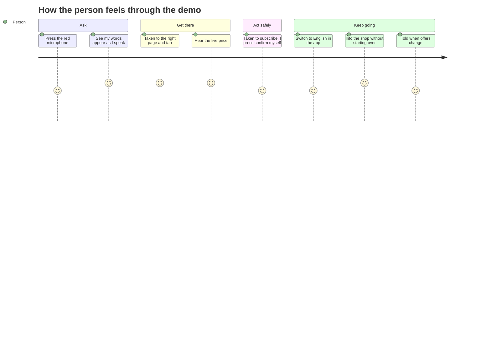

# 09 Demo journey

The eight moments of the [demo script](../product/demo-script.md), the page types they cross, and how each is answered.

```mermaid
flowchart LR
  m0["0 Start anywhere<br/>/ar/home (CMS)"] --> m1["1 إيه أرخص باقة نت؟<br/>→ /ar/mobile-internet-bundles<br/>tab, card, live price<br/>KB plan, no LLM"]
  m1 --> m2["2 اشترك فيها<br/>→ /spa/miManagement (SPA)<br/>stops before confirm<br/>memory + commit guard"]
  m2 --> m3["3 Where's the nearest store?<br/>→ /spa/storeLocator<br/>SPA route, no reload<br/>language switch"]
  m3 --> m4["4 What does this banner say?<br/>bundles hero image<br/>crawl-time description"]
  m4 --> m5["5 وريني الموبايلات<br/>→ eshop.vodafone.com.eg<br/>cross-origin handoff"]
  m5 --> m6["6 Sort them from the lowest price<br/>fallback agent (LLM)"]
  m6 --> m7["7 عرفني لما العروض تتغير<br/>/ar/promotions watch<br/>notification shown on the clone"]
  m7 --> m8["8 خلاص / stop<br/>barge-in"]

  classDef cms fill:#ffffff,stroke:#e60000,color:#333333
  classDef spa fill:#f4f4f4,stroke:#990000,color:#333333
  classDef shop fill:#ffffff,stroke:#333333,color:#333333
  class m0,m1,m4,m7 cms
  class m2,m3 spa
  class m5,m6 shop
```

```mermaid
journey
  title How the person feels through the demo
  section Ask
    Press the red microphone: 4: Person
    See my words appear as I speak: 5: Person
  section Get there
    Taken to the right page and tab: 5: Person
    Hear the live price: 5: Person
  section Act safely
    Taken to subscribe, I press confirm myself: 4: Person
  section Keep going
    Switch to English in the app: 4: Person
    Into the shop without starting over: 5: Person
    Told when offers change: 4: Person
```
