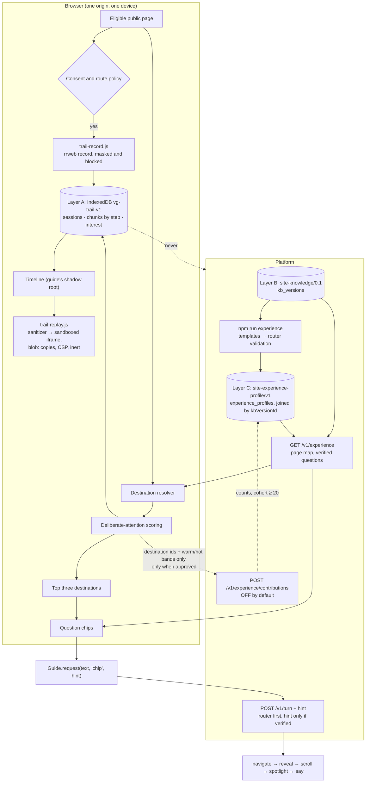
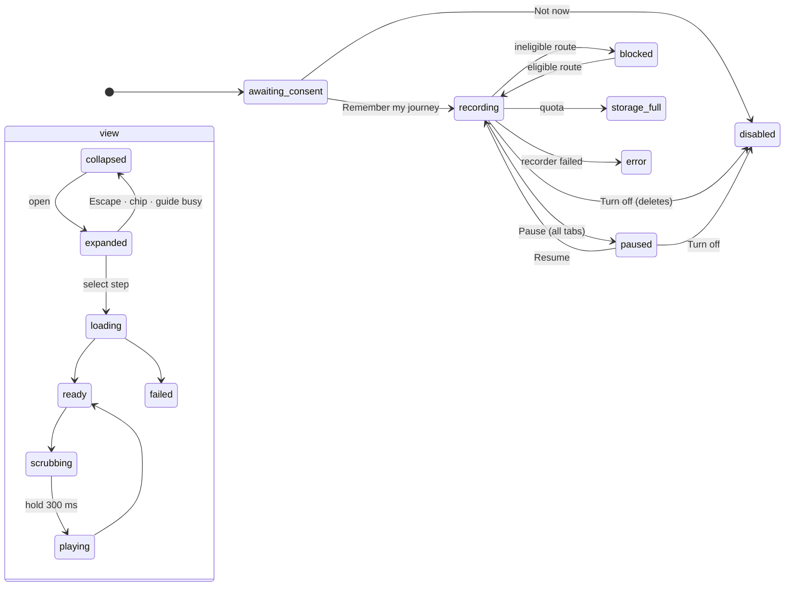

# 10 Exploration Trail: three layers and two flows

What stays in the browser, what comes from the platform, and the only thing that could ever be sent back (SPEC-06, ADR-0035 to ADR-0039).

```mermaid
flowchart TB
  subgraph Browser["Browser (one origin, one device)"]
    P[Eligible public page] --> C{Consent and route policy}
    C -- yes --> R["trail-record.js<br/>rrweb record, masked and blocked"]
    R --> A[("Layer A: IndexedDB vg-trail-v1<br/>sessions · chunks by step · interest")]
    P --> X[Destination resolver] --> I[Deliberate-attention scoring]
    I --> A
    A --> T["Timeline (guide's shadow root)"]
    T --> RP["trail-replay.js<br/>sanitizer → sandboxed iframe,<br/>blob: copies, CSP, inert"]
    I --> Top[Top three destinations]
    Top --> Q[Question chips]
  end
  subgraph Platform
    K[("Layer B: site-knowledge/0.1<br/>kb_versions")]
    E[("Layer C: site-experience-profile/v1<br/>experience_profiles, joined by kbVersionId")]
    J["npm run experience<br/>templates → router validation"] --> E
    K --> J
    M["GET /v1/experience<br/>page map, verified questions"]
    K --> M
    E --> M
    TURN["POST /v1/turn + hint<br/>router first, hint only if verified"]
    AG["POST /v1/experience/contributions<br/>OFF by default"]
    AG -. counts, cohort ≥ 20 .-> E
  end
  M --> X
  M --> Q
  Q --> G["Guide.request(text, 'chip', hint)"] --> TURN
  TURN --> PLAN["navigate → reveal → scroll → spotlight → say"]
  I -. "destination ids + warm/hot bands only,<br/>only when approved" .-> AG
  A -. never .-> Platform
```

```mermaid
stateDiagram-v2
  direction LR
  [*] --> awaiting_consent
  awaiting_consent --> recording: Remember my journey
  awaiting_consent --> disabled: Not now
  recording --> paused: Pause (all tabs)
  paused --> recording: Resume
  recording --> blocked: ineligible route
  blocked --> recording: eligible route
  recording --> storage_full: quota
  recording --> disabled: Turn off (deletes)
  paused --> disabled: Turn off
  recording --> error: recorder failed
  state "view" as V {
    collapsed --> expanded: open
    expanded --> collapsed: Escape · chip · guide busy
    expanded --> loading: select step
    loading --> ready
    loading --> failed
    ready --> scrubbing
    scrubbing --> playing: hold 300 ms
    playing --> ready
  }
```
